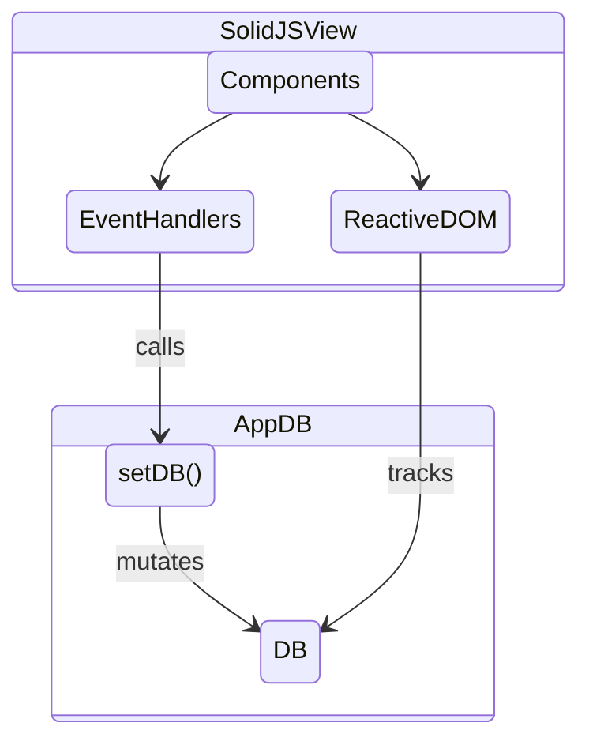
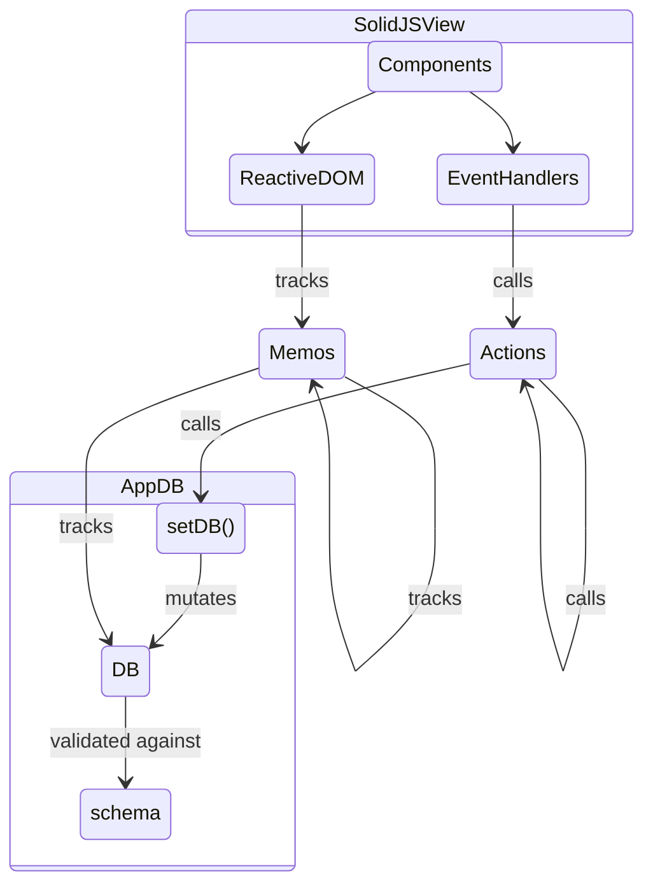

PaaS Price Estimator is a fully client-side JavaScript application. There is no server-side or database component. It's architecturally simple -- most of the complexity is related to handling all the different providers' types of pricing models.

The major libraries in play:

- [SolidJS](https://solidjs.com) :: used for reactive state & view rendering
- [TailwindCSS](https://tailwindcss.com/) :: UI styling framework
- [Vite](https://vitejs.dev/) :: Build tooling

Although the application is simple enough, I'm using it as an exercise for practicing application design with SolidJS reactivity. Solid provides reactive primitives and UI components, but is unopinionated about application design patterns. This can be a good thing (very flexible!) and a bad thing (best practices are not obvious!)

This document contains high-level, unstructured notes about how the code is architected. Might eventually be rewritten as a more coherent document about SolidJS application design patterns.

## State Management

### 1. Transient state: Use SolidJS reactive primitives

Example: `createSignal`, `createEffect`, etc.

Transient state is, intuitively speaking, state that goes away when the user refreshes the page. Examples include un-submitted inputs, open menus, whether the user is dragging, etc.

In other words, transient state is fully encapsulated in a subset of the component tree, and no other part of the application can be dependent on it.

### 2. Non-transient state: Use in-memory "App DB"

Non-transient state usually needs to be persisted (into the URL fragment in the case of PaaS Price Estimator) and benefits from being stored and managed in a centralized way. I use a design and terminology inspired by `re-frame` framework, where all non-transient state is centralized in a global App DB object. Users of Redux-type frameworks may also recognize similarities.

Important note, this is an *in-memory database* stored your browser only. There is no backend database.

The App DB is just a SolidJS Store, with a variety of utility functions wrapped around it. Dataflow to/from the DB looks like this:

### 2a. Alternative For Taming Complexity

If this app was more complicated than it is, and I wanted a stronger separation of concerns with views vs. business logic, I would add a layer of indirection around the App DB, bringing the architecture even closer to `re-frame`:

1. Event handlers do not directly write to the DB, i.e. they don't call `setDb()`. Instead, they call **actions** which in turn call `setDb()`.
2. Reactive views do not create direct reactive dependencies to the `db` store (or any nested subproperties thereof). Instead, they create reactive dependencies on **memos**, which in turn have dependencies on `db`.

In other words, actions and memos are layers of indirection around writing and reading from the App DB, respectively. The indirection is illustrated in the following diagram:

Memos compose naturally and SolidJS handles the reactive dependency tree as we'd expect: if memo `foo` has reactive dependency on memo `bar`, and `bar` has dependency on `db.bar`, then when `db.bar` is updated, `bar` will be recalculated, and if it's changed, `foo` will be recalculated.

Actions can be composed as well, but actions that call `setDb()` more than once -- as composed actions will do -- are non-atomic. If this matters, the action should wrap its implementation in a `batch()` to make the full action apply the mutations to the database all at once.

> **Downsides:** One issue with this approach vs. re-frame is there are no interceptors, and no easy way to "diff" the previous state and the new state (e.g. for implementing undo). There are solutions, but they add complexity. One option is to wrap `setDb()` with another function that implements the interceptor logic and creates deep object copies for comparing state versions. Another is to use an immutable data structure for the DB.