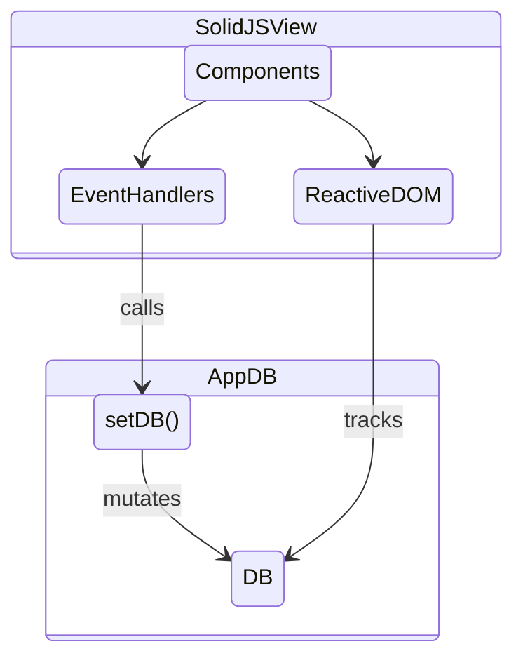
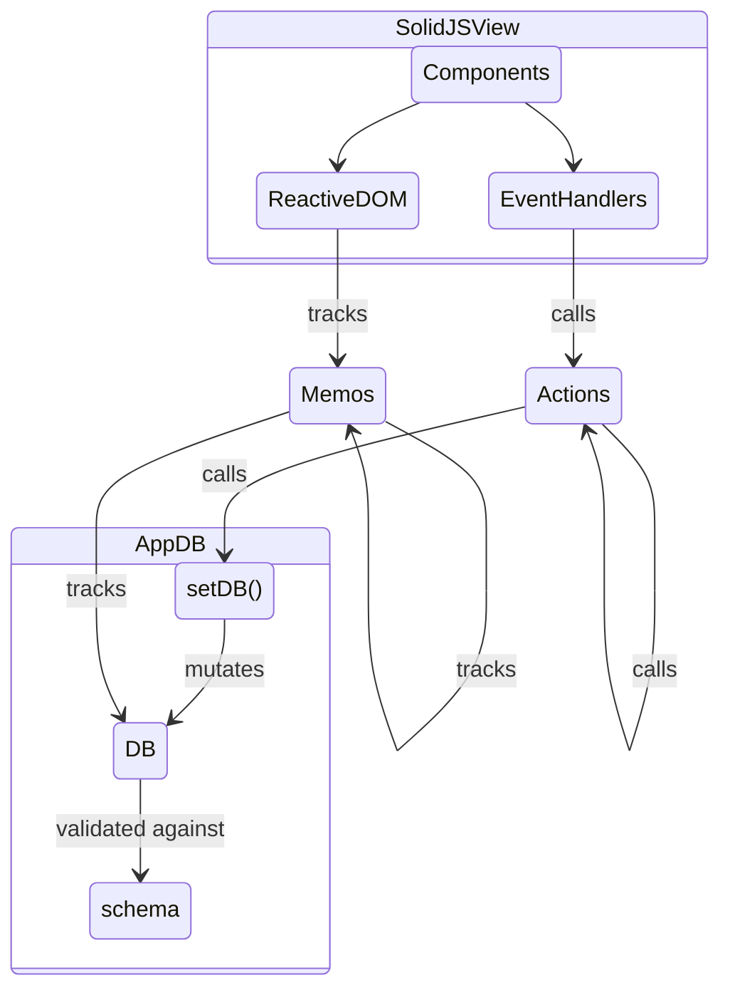

PaaS Price Estimator is a fully client-side JavaScript application. There is no server-side or database component. It's architecturally simple -- most of the complexity is related to handling all the different providers' types of pricing models.

The major libraries in play:

- [SolidJS](https://solidjs.com) :: used for reactive state & view rendering
- [TailwindCSS](https://tailwindcss.com/) :: UI styling framework
- [Vite](https://vitejs.dev/) :: Build tooling

Although the application is simple enough, I'm using it as an exercise for practicing application design with SolidJS reactivity. Solid provides reactive primitives and UI components, but is unopinionated about application design patterns. This can be a good thing (very flexible!) and a bad thing (best practices are not obvious!)

This document contains high-level, unstructured notes about how the code is architected. Might eventually be rewritten as a more coherent document about SolidJS application design patterns.

## State Management

### 1. Transient state: Use SolidJS reactive primitives

Example: `createSignal`, `createEffect`, etc.

Transient state is, intuitively speaking, state that goes away when the user refreshes the page. Examples include un-submitted inputs, open menus, whether the user is dragging, etc.

In other words, transient state is fully encapsulated in a subset of the component tree, and no other part of the application can be dependent on it.

### 2. Non-transient state: Use in-memory "App DB"

Non-transient state usually needs to be persisted (into the URL fragment in the case of PaaS Price Estimator) and benefits from being stored and managed in a centralized way. I use a design and terminology inspired by `re-frame` framework, where all non-transient state is centralized in a global App DB object. Users of Redux-type frameworks may also recognize similarities.

Important note, this is an *in-memory database* stored in your browser only. There is no backend database.

The App DB is just a SolidJS Store, with a variety of utility functions wrapped around it. Dataflow to/from the DB looks like this:




### 2a. Alternative For Taming Complexity

If this app was more complicated than it is, and I wanted a stronger separation of concerns with views vs. business logic, I would add a layer of indirection around the App DB, bringing the architecture even closer to `re-frame`:

1. Event handlers do not directly write to the DB, i.e. they don't call `setDb()`. Instead, they call **actions** which in turn call `setDb()`.
2. Reactive views do not create direct reactive dependencies to the `db` store (or any nested subproperties thereof). Instead, they create reactive dependencies on **memos**, which in turn have dependencies on `db`.

In other words, actions and memos are layers of indirection around writing and reading from the App DB, respectively. The indirection is illustrated in the following diagram:



Memos compose naturally and SolidJS handles the reactive dependency tree as we'd expect: if memo `foo` has reactive dependency on memo `bar`, and `bar` has dependency on `db.bar`, then when `db.bar` is updated, `bar` will be recalculated, and if it's changed, `foo` will be recalculated.

Actions can be composed as well, but actions that call `setDb()` more than once -- as composed actions will do -- are non-atomic. If this matters, the action should wrap its implementation in a `batch()` to make the full action apply the mutations to the database all at once.

> **Downsides:** One issue with this approach vs. re-frame is there are no interceptors, and no easy way to "diff" the previous state and the new state (e.g. for implementing undo). There are solutions, but they add complexity. One option is to wrap `setDb()` with another function that implements the interceptor logic and creates deep object copies for comparing state versions. Another is to use an immutable data structure for the DB.

## Thoughts on New Libraries

In this section, I summarize some thoughts about the new (to me) libraries/tools I've used in this project:

- SolidJS
- TailwindCSS
- Vite

### SolidJS

SolidJS provides a comprehensive-feeling view layer and reactive state management with an impressively small API surface area and minimal "magic."

Some particular aspects of high-quality DX:

1. Excellent TypeScript support.
2. Intuitive lifecycle management (`onMount`, `onCleanup` and `onError`)
3. Built-in SSR support (`renderToString` and `hydrate`)
4. Useful utility components (e.g. `For` and `Suspense`)

As a more general point, the programming model of SolidJS, where component functions are only executed once and updates happen through reactive tracking, is (IMO) more intuitive and pleasant than React's vdom-based approach where component functions are called repeatedly. With the SolidJS approach, reactive and non-reactive code is more clearly separated, as long as you remember the following when writing SolidJS components:

1. The `props` argument is implicitly reactive. Any property accessing, e.g. `props.foo`, is tracked if performed in a reactive scope.
2. JSX templates are implicitly reactive. Any access to reactive values within a JSX template is tracked, and if the values change, the output of the template is updated.
3. If you want to do reactive computations outside of JSX, use `createMemo` (or `createEffect` for side effects).

To illustrate (1) and (2), consider this example:

```jsx
const Counter = (props) => (
  <>Current value: {props.value}</>
);

const IncButton = (props) => (
  <button onClick={props.onClick}>
    Increment
  </button>
);

const App = () => {
  const [value, setValue] = createSignal(0);
  return (
    <>
      <Counter value={value()} />
      <IncButton onClick={() => setValue(v => v + 1)} />
    </>
  );
};
```

In this example, the text rendered in Counter is `Current value: 0`. Then if you click the `Increment` button, the text changes to `Current value: 1`. Why does this happen?

1. `Counter` accesses `props.value` within a reactive scope. This builds a reactive dependency from `props.value -> DOM Text Node`.
2. `App` component provides a reactive value -- `value()` -- to the `Counter`'s `value` prop. This builds a reactive dependency from `value -> props.value`.
3. The button calls `setValue`, which updates the `value` signal. This triggers reactive updates of `props.value` and ultimately the DOM text.

Although Solid is relatively low-magic, there are some confusing parts, especially when you try to pull logic out of JSX. Because the body of a component function isn't automatically a tracking scope, it becomes easy to accidentally break your reactive flow until you get used to it.

For example, the following doesn't track changes to `props.value`, which can be surprising to someone coming from React:

```jsx
const Counter = (props) => {
  const value = props.value;          // not tracked!
  return <>Current value: {value}</>;
};
```

If we want to make this work without putting `props.value` in the JSX, we can use `createMemo`. This tracks changes to `props.value`:

```jsx
const Counter = (props) => {
  const value = createMemo(() => props.value); // tracked
  return <>Current value: {value()}</>;        // tracked
};
```

As the name implies, the `value` accessor returned by `createMemo` is "memoized" -- if the memoized function is re-executed but the return value doesn't change, other reactive values tracking the return value won't re-execute.

For example, consider this:

```jsx
const ZeroChecker = (props) => {
  const isZero = createMemo(() => props.value === 0);
  return <>Value is zero? {isZero()}</>;
};
```

Whenever `props.value` updates, the `isZero` reactive computation executes. But if the result doesn't change (e.g. if `props.value` was `1` and became `2`, `isZero()` being false in both cases), then computations that track `isZero` -- the JSX template value in this case -- won't update.

Better stop here before this becomes a whole SolidJS tutorial!

I do feel like SolidJS would work well with immutable data structures. In theory, the whole Stores concept could be replaced with a single `createSignal()` on an immutable data structure.

### TailwindCSS

Tailwind feels comfortable for rapid prototyping and experiments, promoting the maintenance of a "flow" state. You can just sit there and type out your UI in one place, without switching files or naming things.

Of course, inline CSS works for this too, but is comparatively clunky. If you think utility classes are noisy and clutter up your HTML, try using inline CSS for everything! (And perhaps you say, well just define utility functions for inline CSS, like `m()` and `p()` for margin and padding. I also like this approach, but the nice thing about Tailwind is it's basically defined all that stuff for you, so there's no need to write your own library of helpers. Again, this helps keep you in "flow." When you need something, just type the class. No need to go implement anything.)

The things that really helped me with Tailwind were:

1. The excellent Vite integration, which means I can add Tailwind compilation toolchain to my app with minimal effort. No complicated config or new tools to understand.
2. The Tailwind CSS Intellisense extension for VS Code. Autocomplete helps you stay in the flow without constantly checking the docs. This extension is a huge UX improvement!

The other nice thing about Tailwind was the number of decisions I _didn't_ have to make. From having fixed increments of width/margin/padding, to having a fixed color palette, to having a limited number of font sizes -- the constraints Tailwind enforces actually feel like they help me be _more_ productive instead of being inhibiting. Sort of like a pseudo design system.

I never did end up using Tailwind's @apply components thing. Preferable in my case to use  SolidJS components to define reusable UI elements.

### Vite

I've been seriously impressed with Vite -- both the tool, and the ecosystem around it, are so easy to learn and use. The SolidJS and Tailwind integrations are flawless. It works great on Windows too. It's about as close to zero-configuration as you can get. It really gets out of your way. And it's so _fast_.

Even using SSR, normally one of the most complicated things to have to configure in a build tool, I had a surprisingly good UX with `vite-plugin-ssr`. This was my first time implementing SSR-ish stuff, and I was very impressed that I was able to retrofit my app -- which hadn't been designed for SSR originally -- to use `vite-plugin-ssr` in a few hours.